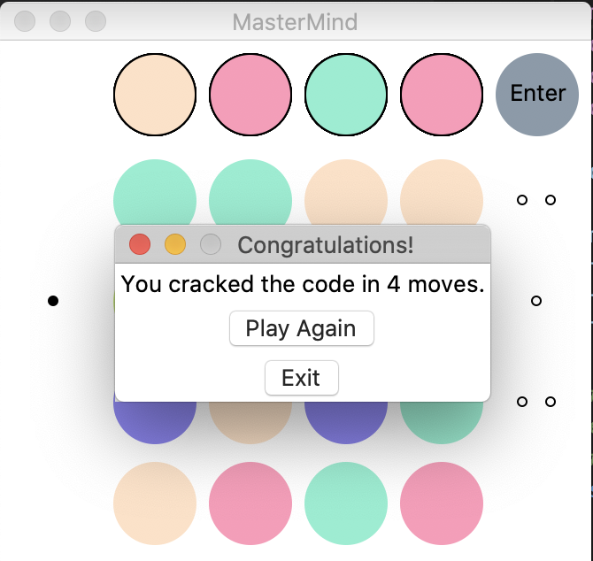
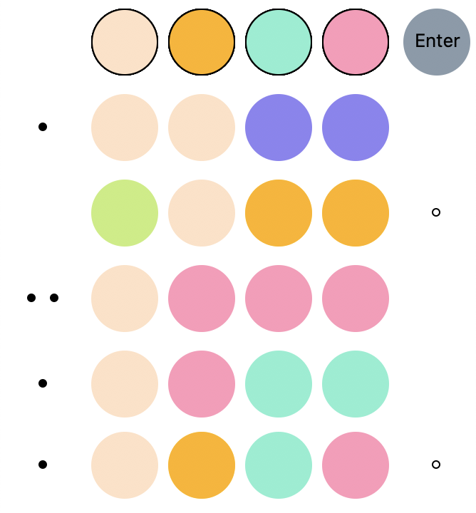

# Mastermind

__Mastermind__ is a simulation of the classic code-breaking board game, [Mastermind](https://en.wikipedia.org/wiki/Mastermind_(board_game)), programmed in Python.

The app requires Python 3 with Tkinter, and can be run using `python mastermind.py`

  
  

### Gameplay

The goal of the game is to guess the randomly-generated code consisting of four random colours. The player can iterate through the six colours using the selection buttons, and enter the guess. For each correct colour at the same index in the code, the player receives one black peg. Of the remaining colours, if any are the right colour at the wrong index, a white peg is awarded. If the player successfully cracks the code in 12 tries, they beat the game.

### Acknowledgments
* __Designed as an implementation of__ Meirowitz' [Mastermind](https://en.wikipedia.org/wiki/Mastermind_(board_game))
* __GUI implemented using__ the [tkinter](https://docs.python.org/3.7/library/tkinter.html) interface package for Python